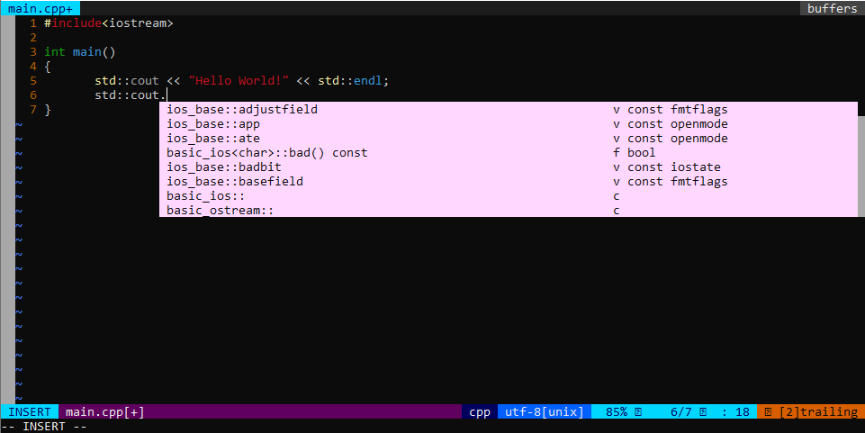
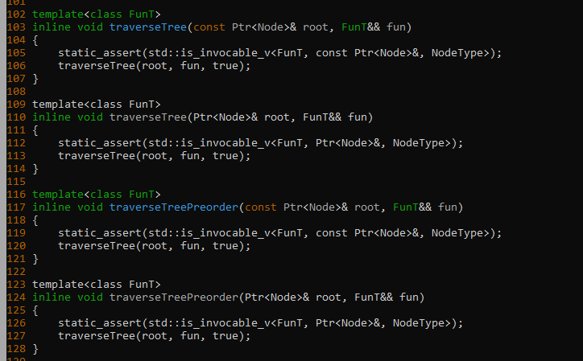
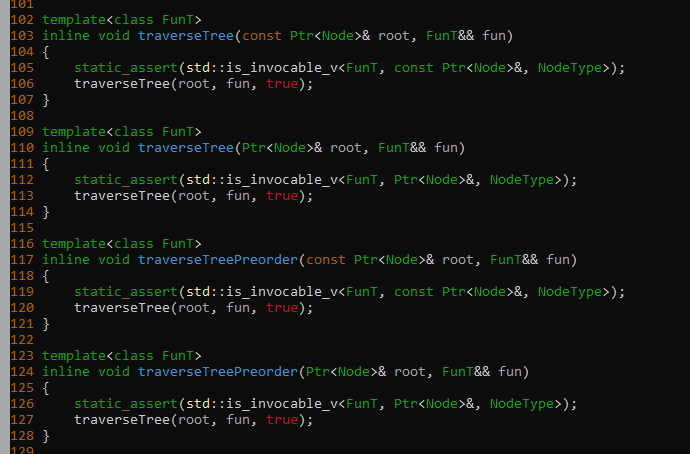

# neovim + ubuntu 18.04

## Environment

* Ubuntu 18.04 

  Note: Headless (server) version is supported, as normally expected with vim.

## Installation

* Install nvim:
  ```
  sudo apt install nvim
  ```
  This installs version 0.2.2 at the time of writing this.
  
* Checkout this repository and copy the init.vim file from it to your filesystem:
  ```
  git clone https://github.com/klosworks/cpponvim.git
  mkdir ~/.config
  mkdir ~/.config/nvim
  mkdir ~/.config/nvim/init.vim
  cp .config/nvim/init.vim ~/.config/nvim/
  ```

* install c++ tools
  ```
  sudo install build-essential gdb cmake
  ```

* Set your vim command to neovim:
  ```
  update-alternatives --config vim
  ```
  The command will list all flavours of vim installed and prompt you to select one by typing a corresponding digit. Do that.

* Install plugin dependencies:

  For YouCompleteMe:
  ```
  sudo apt install build-essential cmake python3-dev
  ```
  For chromatica
  ```
  sudo apt install libclang-dev
  sudo apt install python3-pip
  sudo pip3 install --upgrade pynvim
  ```

* Open vim and download plugins (most are installed by downloading):
  ```
  vim
  :PluginInstall
  ```
  The last command may hang at YouCompleteme.

* Install the compiled plugin components
  ```
  cd ~/.vim/bundle/YouCompleteMe
  git submodule update --init --recursive
  python3 install.py --clang-completer
  ```
  YouCompleteMe is perhaps the most important plugin for development in C++ because it provides functionality like go-to-definition, context help and automatic error detection.
  
  For some reason, this command sometimes fails with the following error:
  ```
  CMake Error: The source directory "/home/(...)/YouCompleteMe/third_party/ycmd/third_party/cregex" does not appear to contain CMakeLists.txt
  ```
  If that happens, do the following, to remove the problematic directory and rebuild the compiled plugin:
  ```
  rm -fr third_party/ycmd/third_party/cregex
  git submodule update --init --recursive
  python3 install.py --clang-completer
  ```
  
* If the :PluginInstall command hanged before, rerun it.
  ```
  vim
  :PluginInstall
  ```
  
* Open vim and update the remote python plugins.
  ```
  vim
  :UpdateRemotePlugins
  ```
  This is needed for Chromatica.vim which provides semantic highlighting (such as coloring depending on whether a variable is a class member or a local variable). This should not be confused with syntax highlighting (such as coloring a keyword or a comment differently than a variable name), which is already supported by vim and doesn't need a plugin.
  

* That's it! you should have a working nvim setup for C++!

## Project setup: Enabling C++ context help features and semantic highlighting

To enable the smart features of installed vim plugins, the C++ project
needs to have a **compile_commands.json** file created by your build system at the folder where you open vim, or a subfolder. This file should be autogenerated. The CMake build system supports generating it. To enable it, you need to add `-DCMAKE_EXPORT_COMPILE_COMMANDS=ON ` argument to you `cmake` invocation, and then copy the resulting *compile_commands.json* file to the root of your project.

## A "Hello World" project to test the setup

You can test your setup with the following Hello World project. Just copy the 3 following files into a single folder and build it.

*build.sh*
```
mkdir -p build
cd build
cmake -DCMAKE_EXPORT_COMPILE_COMMANDS=ON ..
(cd ..; ln -s build/compile_commands.json compile_commands.json)
make -j8
```

*main.cpp*:
```
#include<iostream>
 
int main()
{
   std::cout << "Hello World!" << std::endl;
}
```

*CMakeLists.txt*
```
cmake_minimum_required(VERSION 2.8.9)
project (hello)
add_executable(hello main.cpp)
```

Build it with:
```
bash build.sh
```

You should have compile_commands.json link appear in the root of your project.

You can run the hello application like this:
```
build/hello
```
It should output
```
Hello World!
```

Now you can enjoy the features of this vim setup.
Run
```
vim main.cpp
```

You should see features like semantic highlighting and context help.

Please, test context help it by typing `std::cout.` inside main function and then hitting ctrl+space. You should see hints appear, like this:


Note: 
open vim from the root of your project.
Even if you have subfolders such as `src/package1/module3/ddd.cpp` have console open in the parent of src and open ddd.cpp like this:
```
vim src/package1/module3/ddd.cpp
```
This will ensure that the current working directory in vim is the root of your project, compile_commands.json is found and plugins work correctly.

## Better Chromatica setup

Chromatica relies on libclang 6 by default, which causes issues, particularly with some C++ headers.
Example:


If you have no such issues, skip this section. Maybe Chromatica has been updated and works OK.

### Disabling Chromatica (not recommended)
If you don't like the highliting by Chromatica and would like a more consistent but less powerful highlighting, do `:ChromaticaStop`. This will revert to the default vim highlighting for C++.

### Configuring Chromatica for libclang 9 (recommended)

The default setup works with libclang 6.
This can be changed to libclang 9 with a little bit more of a manual setup.
Caveat: the same essential compile flags will be used for highlighting all c++ files, which may not be suitable for some projects, but will be OK for most new projects.
Caveat: you will have to manually update a file with flags whenever you add an include directory, change C++ standard and probably in other cases. This is very quick but will need to be done sometimes.

First, install libclang 9
```
sudo apt install libclang-9-dev
```

Now there are 2 possibilities:
1. You have installed libclang but no clang
2. You have installed libclang and clang

If the option 2 is correct, you *must* make sure that standalone clang version matches that of libclang.
You have just installed libclang 9 so you must also install clang-9
```
sudo apt install clang-9
```
Now make sure that `clang` is pointing to clang-9
```
clang --version
```
If the above command returned an older version number, do
```
sudo ln -s `which clang-9` /usr/bin/clang
```

Now, Chromatica still uses libclang 6. To make the switch, you need 2 things:
* enable libclang 9 in NVim configuration
* make `.chromatica` file for your project

#### Modify init.nvim
Edit ~/.config/nvim/init.nvim
```
vim ~/.config/nvim/init.nvim
```
Go to the chromatica section and unfold it by typing `zo` in normal mode.
Replace this line
```
let g:chromatica#libclang_path='/usr/lib/llvm-6.0/lib/libclang.so'
```
with
```
let g:chromatica#libclang_path='/usr/lib/llvm-9/lib/libclang.so' 
```

#### Make the .chromatica file 

```
touch .chromatica
```

Then you need to put there the flags from compile_commands.json as well as one option.

First, in the .chromatica file, put the option that will indicate to always treat files as c++, otherwise libclang will keep crashing:
```
echo "flags=--driver-mode=g++" >> .chromatica
```

Then, put the flags there. They can be found in compile_commands.json (after a project is compiled in CMake, see example section above) between `/usr/bin/c++` and `-o` or `-c` option. You only need flags from one translation unit.

An example compile_commands.json
```
[
{
  "directory": "/home/pklos/projects/cp2/build",
  "command": "/usr/bin/c++   -I/home/pklos/projects/cp2/src -I/home/pklos/projects/cp2/build  -O3 -DNDEBUG   -std=gnu++1z -o CMakeFiles/lexer.dir/src/lexer_runner.cpp.o -c /home/pklos/projects/cp2/src/lexer_runner.cpp",
  "file": "/home/pklos/projects/cp2/src/lexer_runner.cpp"
},
...
]
```
The flags are `-I/home/pklos/projects/cp2/src -I/home/pklos/projects/cp2/build  -O3 -DNDEBUG   -std=gnu++1z`.

Then copy the flags in the format `flags=<flag>`

An example resulting .chromatica file can be 
```
flags=--driver-mode=g++
flags=-I/home/pklos/projects/cp2/src
flags=-I/home/pklos/projects/cp2/build
flags=-O3
flags=-DNDEBUG
flags=-std=c++1z
```

In the end, you will have correct highlighting



## More advance use of the plugins

* Look online at NERDTree plugin documentation for some basic navigation within a project directory tree. 
* Read ~/.config/nvim/init.nvim file. You will find that it is pretty well documented inside. Please try various commands defined using the nnoremap and inoremap commands. 
Hints:
  * Some contents are folded. To unfold, place your cursor on a folded line and type `zo`. To fold back, type `zc`.
  * the `<leader>` key is defined as ',' (the comma).
  
